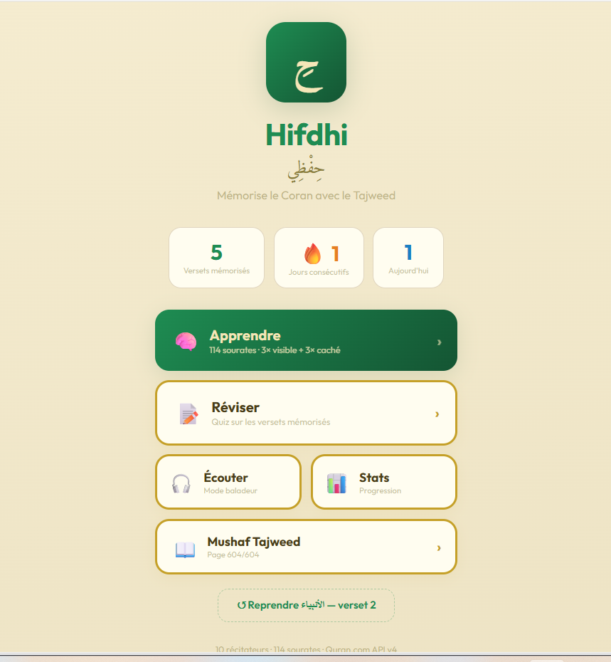
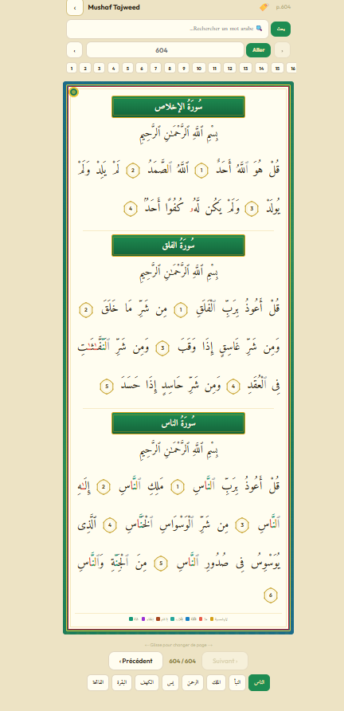
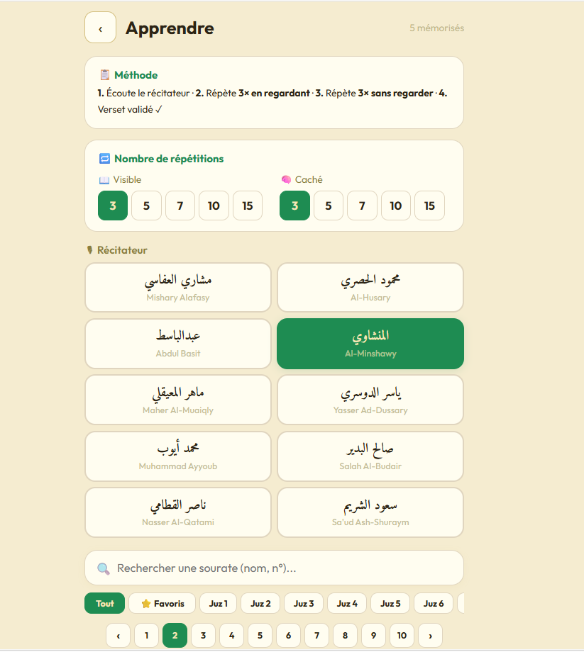
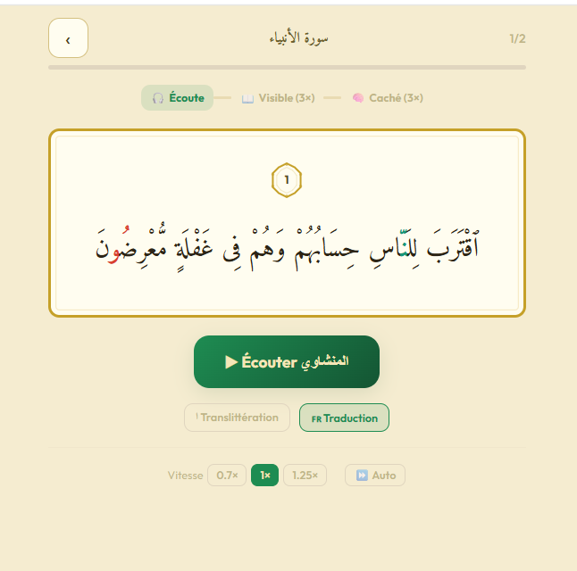
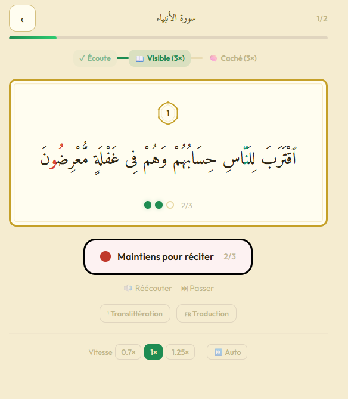
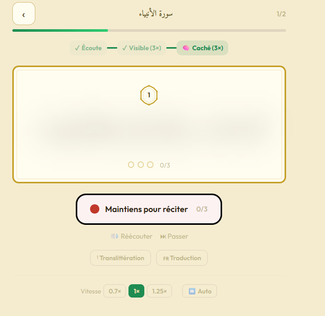

# HIFDHI حِفْظِي

> A Quran memorization app with authentic Tajweed rendering, 
> 100% offline, built from scratch in React.

## Overview

Hifdhi is a personal project aimed at solving a real problem in Arabic 
digital education: most Quran apps either sacrifice traditional Tajweed 
color-coding for simplicity, or lock it behind paywalls and poor UX. 
Hifdhi reimplements the **17 Tajweed rules of the Dar Al-Maarifah tradition** 
in a fully offline, mobile-first interface — combining a traditional 
Mushaf viewer with a spaced-repetition memorization system (SM-2 variant) 
and a social layer for community learning.

The project is technically a cross-platform React + React Native codebase, 
but it's also an exploration of how Arabic-first interfaces (RTL typography, 
proper tajweed rendering, culturally accurate UX) can be built without the 
usual shortcuts. This intersects with questions I find increasingly 
important: how do we build AI and software tools that treat Arabic as 
a first-class language rather than an afterthought?

## Screenshots







## Status

🚧 Active development. Core features functional: Mushaf viewer with 
full Tajweed coloring (114 surahs), memorization mode (3-phase), 
spaced repetition queue, offline storage. In progress: social layer 
(friends' real-time reading positions), mobile build refinements.

## Tech stack

- **Frontend**: React + Vite (web) / React Native (mobile)
- **Data**: Quran.com API v4 (fetched once, cached offline)
- **Audio**: EveryAyah.com (4 reciters)
- **Typography**: KFGQPC Uthman Taha Naskh (fallback: Amiri)
- **Storage**: AsyncStorage with custom schema for progress + SR state
- **Spaced repetition**: SM-2 variant (ease factor, interval, quality)

---

## Setup

### 1. Cloner le projet

```bash
git clone https://github.com/YOUR_USERNAME/Hifdhi.git
cd Hifdhi
```

### 2. Installer les dépendances

```bash
npm install
```

### 3. Configurer les variables d'environnement

```bash
cp .env.example .env
```

Le fichier `.env.example` contient déjà les valeurs par défaut des APIs publiques utilisées (Quran.com, EveryAyah.com, Google Fonts). Tu peux les modifier si besoin.

### 4. Lancer le projet

```bash
npm run dev
```

L'app sera disponible sur `http://localhost:3000`.

### Variables d'environnement

| Variable | Description | Valeur par défaut |
|----------|-------------|-------------------|
| `VITE_QURAN_API_BASE` | URL de base de l'API Quran.com v4 | `https://api.quran.com/api/v4` |
| `VITE_EVERYAYAH_BASE` | URL de base EveryAyah.com (audio) | `https://everyayah.com/data` |
| `VITE_GOOGLE_FONTS_URL` | URL Google Fonts (Amiri + Outfit) | `https://fonts.googleapis.com/css2?...` |

## Architecture

```
Hifdhi/
├── README.md
├── hifdhi.jsx                          # Legacy single-file (v9)
│
├── scripts/
│   └── fetch-tajweed.js                # Node.js — génère quran-tajweed.json
│
├── data/
│   └── quran-tajweed.json              # Généré (5-8 MB) — 114 sourates offline
│
├── assets/
│   └── fonts/
│       ├── KFGQPCUthmanTahaNaskh.ttf   # Police principale (à télécharger)
│       └── .gitkeep
│
└── src/
    ├── App.jsx                         # Point d'entrée — orchestre les 4 écrans
    │
    ├── components/
    │   ├── index.js                    # Barrel exports
    │   ├── TajweedVerse.jsx            # React Web — <span> imbriqués
    │   ├── TajweedVerse.native.jsx     # React Native — <Text> imbriqués
    │   ├── AyahMarker.jsx              # Marqueur octogonal doré (Web)
    │   ├── AyahMarker.native.jsx       # Marqueur octogonal (RN + SVG)
    │   ├── SurahBanner.jsx             # Bannière titre sourate
    │   ├── MushafFrame.jsx             # Cadre ornemental Mushaf
    │   ├── TajweedLegend.jsx           # Légende couleurs (compact + full)
    │   ├── ProgressBar.jsx             # Barre de progression animée
    │   └── RepDots.jsx                 # Points de répétition
    │
    ├── screens/
    │   ├── index.js                    # Barrel exports
    │   ├── HomeScreen.jsx              # Écran 1 — Accueil + stats
    │   ├── LearnListScreen.jsx         # Écran 2 — Liste 114 sourates
    │   ├── StudyScreen.jsx             # Écran 3 — Mémorisation 3 phases
    │   ├── MushafScreen.jsx            # Écran 4 — Mushaf Tajweed complet
    │   └── ReviewScreen.jsx            # Écran 5 — Révision SR (spaced rep)
    │
    ├── constants/
    │   ├── tajweed-colors.js           # 17 règles Dar Al-Maarifah + hex
    │   ├── audio.js                    # 4 récitateurs EveryAyah.com
    │   ├── fonts.js                    # Config polices + @font-face
    │   └── surahs.js                   # Métadonnées 114 sourates
    │
    ├── data/
    │   └── loader.js                   # Chargeur offline quran-tajweed.json
    │
    └── storage/
        ├── schema.js                   # Schéma AsyncStorage complet
        └── storage.js                  # CRUD + streak + SM-2 spaced rep
```

## Démarrage rapide

### Étape 1 — Générer les données offline

```bash
node scripts/fetch-tajweed.js
```

Cela appelle l'API Quran.com v4 pour les 114 sourates et génère `data/quran-tajweed.json` (~5-8 MB).
**Tu ne le fais qu'une seule fois.** Après, tout est offline.

### Étape 2 — Installer la police

Télécharge **KFGQPC Uthman Taha Naskh** depuis :
- https://fonts.qurancomplex.gov.sa/
- Ou cherche "KFGQPC Uthman Taha Naskh" sur GitHub

Place le `.ttf` dans `assets/fonts/KFGQPCUthmanTahaNaskh.ttf`.

Fallback automatique sur **Amiri** (Google Fonts) si la police n'est pas disponible.

### Étape 3 — Intégrer dans ton projet

```jsx
import App from './src/App';
// ou
import { TajweedVerse, MushafFrame, AyahMarker } from './src/components';
```

## Les 17 règles Tajweed (Palette Dar Al-Maarifah)

| # | Règle | Arabe | Couleur |
|---|-------|-------|---------|
| 1 | Ghunnah | غُنَّة | `#16A858` 🟢 |
| 2 | Ikhfā' Haqīqī | إِخْفَاء | `#9B30D4` 🟣 |
| 3 | Ikhfā' Shafawī | إِخْفَاء شَفَوِي | `#D97EF2` 🟪 |
| 4 | Idghām w/ Ghunnah | إِدْغَام بِغُنَّة | `#169777` 🟢 |
| 5 | Idghām w/o Ghunnah | إِدْغَام بِلَا غُنَّة | `#169777` |
| 6 | Idghām Shafawī | إِدْغَام شَفَوِي | `#169777` |
| 7 | Idghām Mutajānisayn | إِدْغَام مُتَجَانِسَيْن | `#A6461F` 🟤 |
| 8 | Idghām Mutaqāribayn | إِدْغَام مُتَقَارِبَيْن | `#A6461F` |
| 9 | Iqlāb | إِقْلَاب | `#26A4CC` 🔵 |
| 10 | Qalqalah | قَلْقَلَة | `#4050EC` 🔵 |
| 11 | Madd Ṭabī'ī | مَدّ طَبِيعِي | `#FF7F00` 🟠 |
| 12 | Madd Jā'iz | مَدّ جَائِز | `#E12B29` 🔴 |
| 13 | Madd Wājib | مَدّ وَاجِب | `#CA0004` 🔴 |
| 14 | Madd Lāzim | مَدّ لَازِم | `#B90053` 🟣 |
| 15 | Lām Shamsiyyah | لَام شَمْسِيَّة | `#D4A017` 🟡 |
| 16 | Hamzat al-Waṣl | هَمْزَة الوَصْل | `#AAAAAA` ⚪ |
| 17 | Lettre silencieuse | حَرْف لَا يُنْطَق | `#AAAAAA` ⚪ |

## Audio — 4 récitateurs (EveryAyah.com)

| Récitateur | Path | Qualité |
|-----------|------|---------|
| Mishary Alafasy | `Alafasy_128kbps` | 128 kbps |
| Mahmoud Al-Husary | `Husary_128kbps` | 128 kbps |
| Abdul Basit | `Abdul_Basit_Murattal_192kbps` | 192 kbps |
| Al-Minshawi | `Minshawi_Murattal_128kbps` | 128 kbps |

URL pattern: `https://everyayah.com/data/{path}/{SSS}{AAA}.mp3`

## Stockage (AsyncStorage)

| Clé | Contenu |
|-----|---------|
| `@hifdhi:progress` | `{ "surahId:verseIdx": { memorized, visibleReps, hiddenReps, srLevel, srInterval, srEaseFactor, srNextReview, ... } }` |
| `@hifdhi:streak` | `{ currentStreak, longestStreak, lastActiveDate, totalSessions, weeklyHistory }` |
| `@hifdhi:settings` | `{ reciterId, visibleRepsTarget, hiddenRepsTarget, tajweedEnabled, fontSize }` |
| `@hifdhi:sr_queue` | `{ dueToday: ["1:0", "2:3", ...], lastComputed }` |

Le **spaced repetition** utilise une variante de SM-2 :
- Qualité 0-2 → reset à jour 1
- Qualité 3+ → interval × easeFactor
- easeFactor ajusté par la formule SM-2 (min 1.3)
